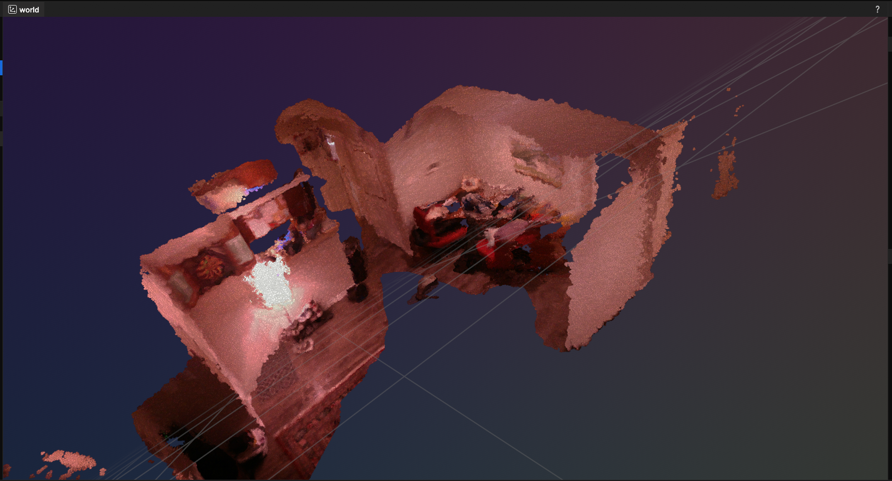

# realsense-colmap

Capture RGB-D video from an Intel RealSense camera and turn it into a dense,
colored 3D point cloud (optionally a mesh), using COLMAP for camera pose
estimation.



## How it works

Monocular structure-from-motion (what COLMAP does from RGB images alone) only
recovers camera poses up to an unknown scale, and its own dense multi-view
stereo re-derives depth slower and less accurate than a depth sensor. Since a
RealSense gives us real metric depth directly, this pipeline splits the work.

1. **Capture** -- stream color + depth (aligned to color) from the camera,
   save every frame pair plus the camera intrinsics.
2. **Sparse reconstruction (COLMAP / pycolmap)** -- run SfM on the color
   images to recover a self-consistent camera trajectory (up to scale).
3. **Scale recovery** -- compare the depth SfM's own triangulated points
   imply against the depth the RealSense actually measured at those pixels;
   the median ratio gives a metric scale factor for the whole trajectory.
4. **Dense fusion** -- back-project every RealSense depth pixel of every
   registered frame through its (now-metric) pose into one world frame,
   merge, downsample, and remove outliers -- `dense.ply`. Optionally run
   Poisson surface reconstruction for a mesh (`--mesh`).

## Usage
```sh
uv run realsense-colmap capture -o data/scene1 --seconds 20 --every-n 2
uv run realsense-colmap reconstruct -i data/scene1 --mesh
uv run realsense-colmap view data/scene1/reconstruction/dense.ply
```

Output goes to `data/scene1/reconstruction/`: `sparse/0/` (COLMAP model),
`dense.ply`, and `mesh.ply` if `--mesh` was passed.

`view` also accepts `mesh.ply`, and `--save out.rrd` writes a recording to
disk instead of spawning the interactive viewer (open it later with
`rerun out.rrd`).

See `realsense-colmap capture/reconstruct/view --help` for all options
(resolution/fps, matcher choice, depth range, voxel size, etc).

## Exposure/Gain

`capture` supports manual exposure/gain and laser power for dark
rooms:

```sh
uv run realsense-colmap capture -o data/scene1 --fps 6 \
    --color-exposure 1200 --color-gain 80 --laser-power 300
```

`--color-exposure` is in 100us units, and the sensor can't expose longer than
one frame interval -- e.g. `--color-exposure 1200` (120ms) needs `--fps <= 8`
to actually take effect rather than getting silently capped (the CLI warns if
your combination doesn't fit). `--laser-power` (0-360) boosts the IR dot
pattern the depth sensor's stereo matching relies on, which matters more the
dimmer the room is. `--auto-exposure-priority` is a lighter-touch alternative
to manual exposure: it just lets the frame rate drop instead of capping
exposure to hold it, so you don't have to hand-tune anything.
